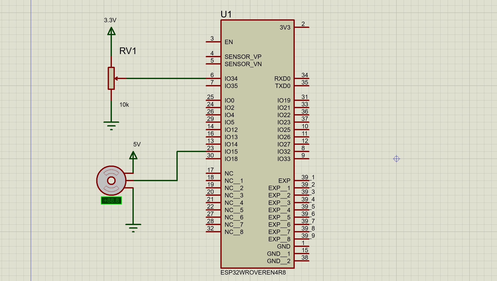

# esp32-servo-experiment

ESP32/servo motor hello world. You turn the potentiometer, and servo turns the same way.

## How to do things

* `pio run -t upload -t monitor` - to build and run

## Schematic

